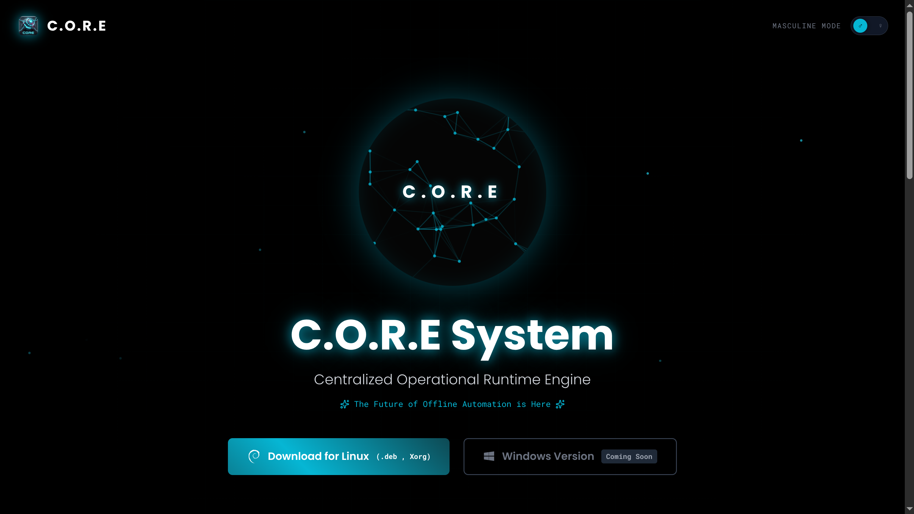
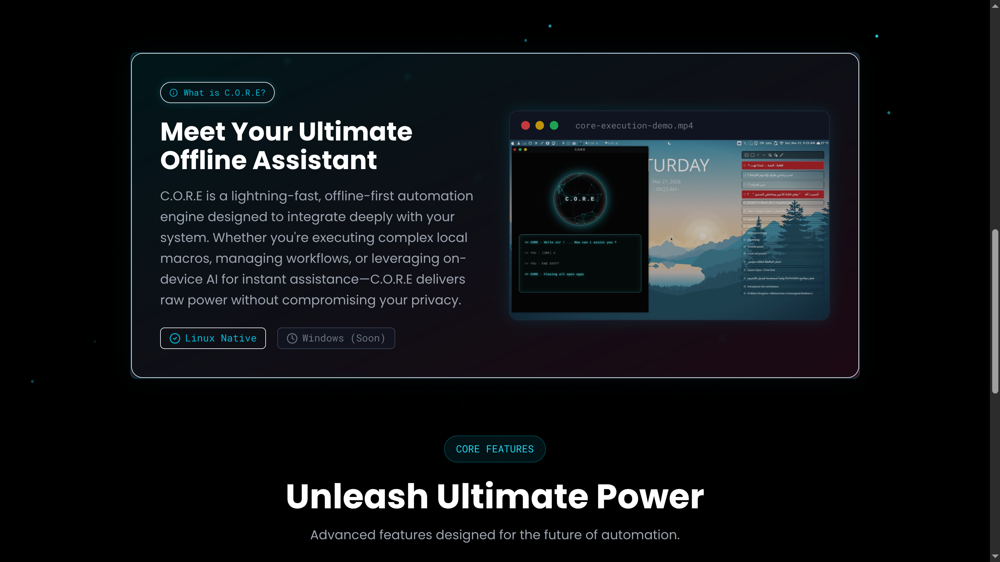
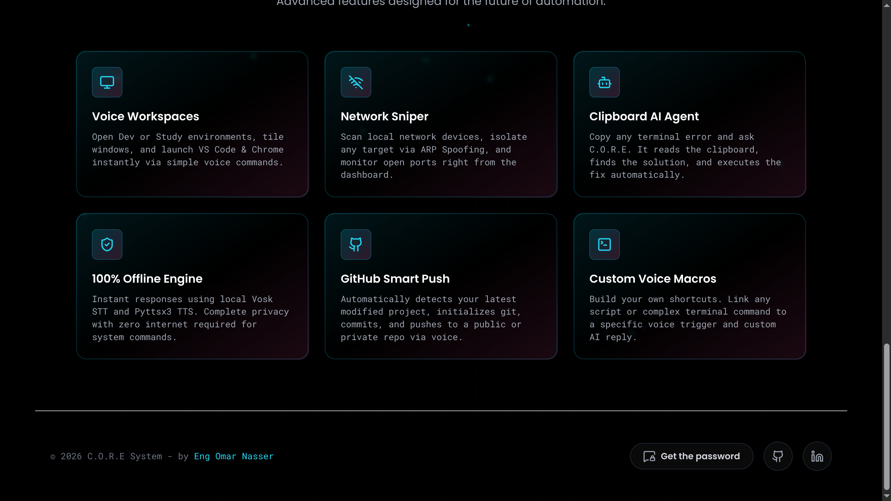

# 🌌 C.O.R.E System - Frontend Dashboard
**Centralized Operational Runtime Engine - The Ultimate Offline Linux Assistant UI**





## 🚀 Overview
This repository showcases the **Front-End Architecture and UI/UX Design** of the C.O.R.E System. 
Originally built as a Python-based offline assistant (formerly known as Jarvis), the project evolved into a fully-fledged desktop orchestration tool. This repo highlights the front-end dashboard designed to bridge the gap between heavy backend Python scripts and a seamless, futuristic user experience.

As a **Full-Stack Developer**, I engineered this interface to be exceptionally lightweight, visually striking, and entirely framework-free to ensure 0ms latency when integrated with the Python `Eel` library.

## ✨ UI/UX Highlights
- **Futuristic Cyberpunk Aesthetic:** Neomorphic transparent cards, animated gradient borders, and synchronized glow effects.
- **Interactive 3D Neural Orb:** A lightweight, custom-configured `particles.js` instance that reacts to user interactions without draining system resources.
- **Framework-Free Performance:** Built entirely with **Vanilla HTML, CSS, and JavaScript**. No React, no Vite, no heavy node_modules. Just pure, unadulterated web technologies optimized for desktop integration.
- **Dynamic Theme Engine:** Seamless transition between themes (Masculine/Feminine modes) altering root CSS variables on the fly.
- **Fluid Micro-interactions:** Custom scroll-reveal animations and simulated terminal glitch effects engineered via pure CSS keyframes.

## 🛠️ Tech Stack
- **Structure:** HTML5
- **Styling:** Tailwind CSS (via CDN for zero-build-step deployment) + Custom CSS.
- **Logic:** Vanilla JavaScript.
- **Icons:** Lucide Icons.
- **Visuals:** Particles.js (optimized for 40 nodes to maintain low CPU overhead).

## 💡 Why Vanilla? (The Engineering Decision)
Integrating a heavy front-end framework (like React or Vue) into a local Python desktop application (via `Eel` or `PyQt`) often results in unnecessary memory bloat. By utilizing Vanilla JS and Tailwind, the C.O.R.E dashboard achieves:
1. **Instant Load Times:** Bypassing virtual DOM overhead.
2. **Minimal RAM Footprint:** Crucial for a system assistant running 24/7 in the background.
3. **Direct DOM Manipulation:** Easier bridging with Python backend asynchronous callbacks.

## 📥 How to Run
No `npm install` or `npm run dev` required. 
Simply clone the repository and open `index.html` in your favorite browser.

```bash

git clone [https://github.com/yourusername/CORE-Frontend.git](https://github.com/yourusername/CORE-Frontend.git)
cd CORE-Frontend
# Double click index.html
```
Designed & Engineered by **Eng Omar Nasser**
